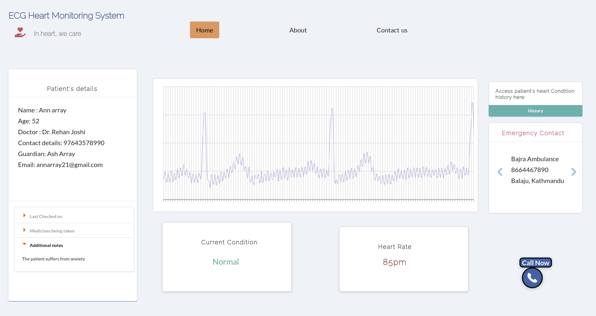

# Diagnosis of Cardiovascular Diseases with CNN using Data Obtained from Wireless Holter

The aim of this project is to design a systematic method of analyzing the Electrocardiogram (ECG) from patients and displaying the types of disorders. It is designed to wirelessly interface the holter for ECG signal extracion and to process and classify the obtained data for disease diagnosis. 

## Overview of the folders

### 1. Model  
Data preprocessing and training of the different models using SVM classifier, Logistic Regression, KNN classifier and CNN.

| Models | Train Accuracy | Test Accuracy | Precision | Recall | F1-Score
| :---         |     :---:      |          :---: | :---:        |     :---:      |          :---: |
|SVM | 98.56% | 96% | 98.59% | 98.56% | 98.57% 
| Logistic Regression | 89.05% | 74% | 89.03% | 89.06% | 89.03%
|CNN | 99.8% | 99.67% | 100% | 100% | 100%

[Link to the model training repo.](https://github.com/eternal-moon/ECG-Arrythmia)

### 2. SavedModel  
Saved CNN model in `.h5` format

### 3. TestData  
Csv files containing heart signals of a normal person without any underlying heart disease (obtained using holter).

### 4. backend
Use of database, process the raw ecg signals and use of the saved CNN model to predict the outcomes

### 5. src and public folder
Frontend in reactjs.

## Installation

1. Create a virtual enviroment inside the backend directory.

2. Install the requirements.txt inside the virtual environment using:  
 `$ pip install -r requirements.txt`

3. Run  
`$ python run.py`  
`$ python getData.py`

4. In the main directory run  
`$ npm start`
